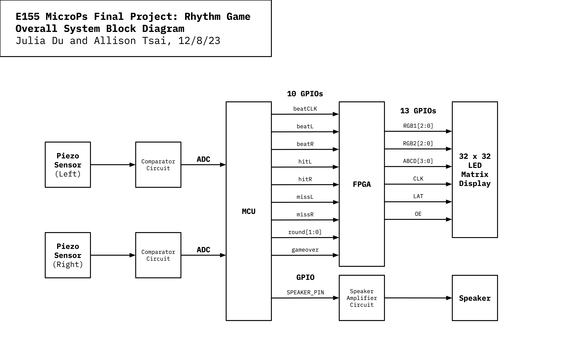

E155 MicroPs Final Project: Rhythm Game

By Julia Du and Allison Tsai

December 8, 2023

# Project Abstract
<iframe width="560" height="315" src="https://youtube.com/embed/-NsTOWbOhzw" title="YouTube video player" frameborder="0" allow="accelerometer; autoplay; clipboard-write; encrypted-media; gyroscope; picture-in-picture" allowfullscreen></iframe>
*Note: in the video, some pixels appear to be pulsing at certain times; however, this is only visible on camera and not in real life.*

This project implements a drumming rhythm game using a microcontroller and FPGA that interface with piezo sensors, a speaker, and an 32 x 32 LED matrix display. Players must listen to the music and watch the beats scrolling down the display in order to time their hits on the two drums (left and right) correctly. There are three rounds, and each successive round is faster than the previous. If the user passes all three rounds (i.e. hit at least 50% of the notes), they win.

# Project Motivation
This project was inspired by the MicroPs speaker lab and MicroPs game projects from previous years. In order to combine music and gaming, we decided to create a rhythm game. This game was mostly modeled after the Taiko arcade game which require players to hit a drum; using a drum input would allow us to work with a new type of sensor: piezos. In addition, the visual display of our game was inspired by DDR, with each beat in its own channel scrolling vertically on the screen. 

# Overall System Design

The microcontroller is responsible for reading inputs from two piezo sensors through ADC and playing the music on a speaker through GPIO pins. It determines the scoring of the game and tells the FPGA information through GPIO pins. This information includes the round number, the player's hits and misses, whether the player has won or lost, the speed of the beats on the display, and when beats should start scrolling down the display. Then, the FPGA is responsible for displaying this information on a 32 x 32 LED display matrix. 