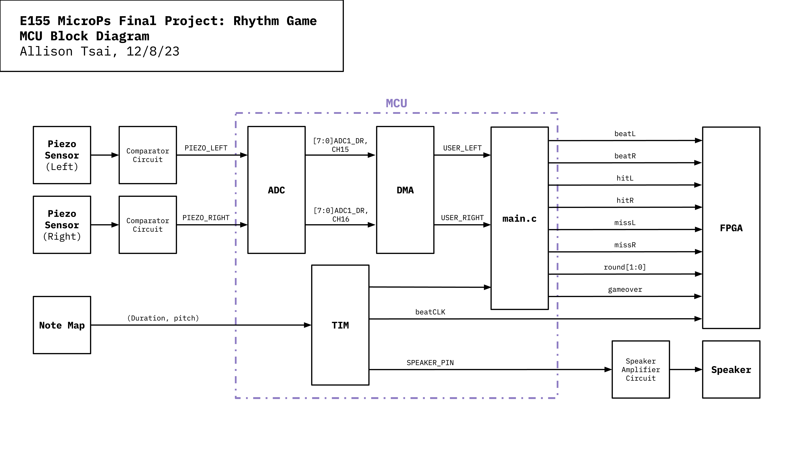
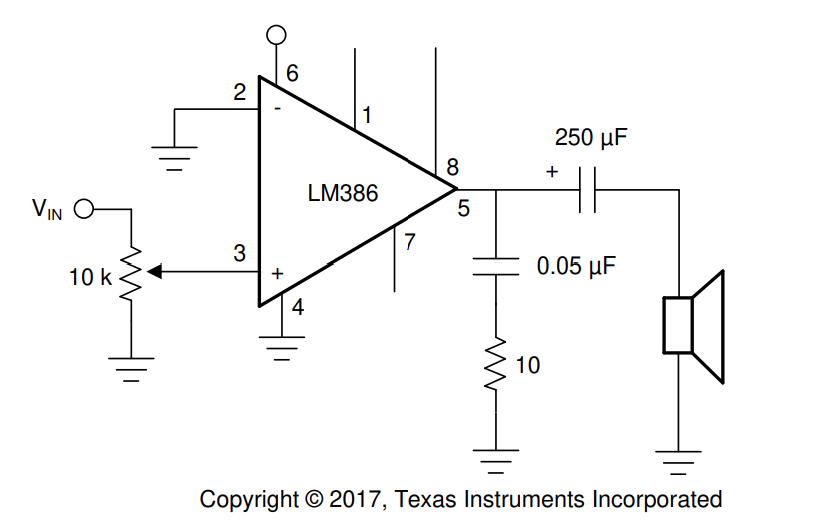

# New Hardware

The new hardware used was Adafruit's small enclosed piezo sensors. Piezo devices can convert mechanical energy into electrical energy or vice versa. Thus, they were used to "sense" user inputs by translating vibration into readable voltage.

The two piezo sensors were attached to back of two drum pads. These pads were laser cut out of 1/8" plywood and screwed onto a circular base with stands using 10-24 button head screws and hex nuts. Both the base and stands were machined using a vertical bandsaw and were made from 1/2" plywood. To isolate the vibrations from the pads, rubber washers and spacers were placed between the base and the pads. The spacers were 3D printed out of TPU. The CAD for the drum is available [here](https://github.com/julia-du/Rhythm-Game/tree/main/src/CAD).

# MCU System Design

The MCU uses three peripherals: `ADC`, `DMA`, and `TIM`. The `ADC` peripheral is responsible for converting the analog voltage from the piezo sensors to DC voltage. The `DMA` peripheral is responsible for data transfers between the `ADC` registers and a temporary memory address. The `TIM` peripheral is responsible for generating the beat clock, the frequency waveform that goes to the speaker, and a duration timer. (see FPGA section for the definitions of all the outputs going from the MCU to the FPGA)

## ADC and DMA

The piezo sensors were connected to a comparator circuit that sends 3.3 V to the `ADC` pin if the sensor generates a voltage above 1.1 V. The sensor is also connected in parallel with a resetting resistor that has a value of 10 MΩ. When the generated voltage has dissipated to a value below the threshold, the current will then flow through the resetting resistor, helping to discharge any leftover voltage. When the `ADC` pin receives the 3.3 V, the data register will generate a value anywhere between 0 and 255. For both sensors, the data register will generate a value of at least 180. 

To process both sensors, the `ADC` peripheral was configured such that there would be continous conversions with an 8-bit resolution; `ADC` would scan the right sensor pin first (channel 16) and then the left sensor pin (channel 15). Each channel was set to have a sampling time of 2.5 ADC clock cycles.

Since there is more than one channel being converted at a time, the `DMA` peripheral was set up to manage these conversions. For this, the `DMAEN` and `EOCIE` bits were set to 1 such that channel interrupts and `DMA` mode was enabled for `ADC`. After a channel has been converted, the channel interrupt will be written to 1, signaling a `DMA` request to be generated. This allows the transfer of the converted data from the `ADC_DR` register to a specified temporary memory address. 

## TIM

To match the FPGA, the MCU's system clock was set to be 24 MHz. Three timers were used in this design: `TIM2`, `TIM15`, and `TIM16`. Both `TIM2` and `TIM15` were configured to their PWM mode, where a signal is generated with a frequency determined by the value of the auto reload register (`TIMx_ARR`) and a duty cycle determined by the value of the capture/compare register (`TIMx_CCRx`). For simplicity, both waveforms have a duty cycle of 50%. `TIM2` represents the duration of each note; this is the beat clock. `TIM15` represents the frequency of the note; this is speaker pin. `TIM16` also represents the duration of each note, but instead of being configured into an output waveform, it was used in a looping logic. 

There is an amplifier circuit between the speaker pin and the speaker because the current draw of the speaker is greater than the max current output of the MCU pin. The internal gain of the amplifier is 20 and the minimum gain needed is 10, thus the circuit was wired according to the schematic below, excluding any resistor and bypass capacitors. 

## main.c

The main.c file contains all the logic for the rhythm game. The game progresses according to a `note_map`, which is an integer array of arrays containing the note duration and frequency. For this project, this `note_map` was written to play the Tetris theme which has a time signature of 4/4. Because of the time signature, each note was broken down into sixteenth notes such that a steady beat clock can be sent to the FPGA.  

The program progresses through the `note_map` using a while loop nested in a for loop. The while loop checks if `TIM16` has reached the note's playing time. If the playing time is over, then the for loop will iterate through the `note_map`. If the playing time is not over, then the program will check if the player has hit the drum. If the player has hit the drum, then it will check if there is a beat that had to be played using the `beat_map`. The `beat_map` is an integer array containing the same number of arrays as the `note_map` except these arrays consist of 3 elements: (1) whether or not there is a beat, (2) if there is a left beat, and (3) if there is a right beat. If the 0th element in the array is 0—in other words, there is no beat—then the first and second element will always be 0. If the user plays the beat correctly, then they will earn a point and that beat in the map will be written to 0. This was done to avoid double counting. Additionally, the MCU will write 1 to `hitL` and/or `hitR`. If the user plays the beat incorrectly or if they miss a beat, then the MCU will write 1 to `missL` and/or `missR`. If they user hits the drums when there's no beat, nothing happens; they are not penalized. At the beginning of each `note_map` iteration (for loop), the MCU is writing 0 to `hitL`, `hitR`, `missR`, and `missL`. It is also sending the left and right beats from the `beat_map` to `beatL` and `beatR`. Since it takes some time for the notes to fall down on the display, there is an added two measures of silent delay in the `note_map`. This is the foundation of the game logic. 

To implement rounds and increasing speeds, the basic game logic is nested in another while loop that tracks the round number. At the beginning of this while loop, the MCU writes the round number to `round[1:0]`. At the end of the while loop, it checks the user score against a threshold. If the user score does not meet the threshold, then the program will break out of this loop and write 1 to `gameover`. If the user score does meet the threshold, then the round number will increment by 1 and the decrease the duration of the notes by a factor of 1/6. Additionally, it will rewrite the `beat_map` using a copy of the `beat_map` and the function `memcpy`. If the user makes it to the third round and passes the point threshold, then the MCU will write 3 to `round[1:0]` to tell the FPGA to display the "win" screen.

# Sources
1. [Resetting resistor discussion](https://electronics.stackexchange.com/questions/591824/buzzer-differences-and-configurations)
2. [DIY Taiko Controller](https://www.youtube.com/watch?v=iDH8DRCk5Zs)
3. [Audio Amplifier Datasheet](https://www.ti.com/lit/ds/symlink/lm386.pdf)