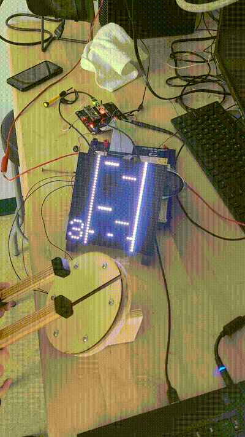
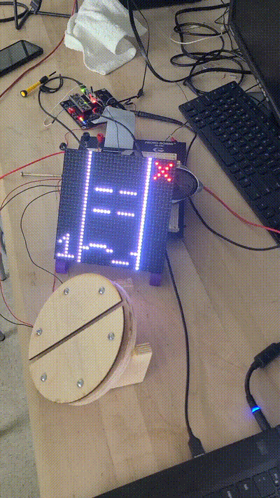

 

# Results

All of the specs we noted in our project proposal were met. The MCU correctly plays the notes in tune, sends the beats to the FPGA on time, and scores the hits from the user. This is consistent even when the length of each quarter note is only 1.13 seconds. The FPGA correctly displays the beats scrolling down, hits and misses, the round number, and the losing or winning screen without any visible flickering or bleeding. 

# Future Work

## MCU

In the current design, the piezo voltage is being regulated by a comparator circuit because the voltage can potentially spike up to 16V and break the MCU pin. While this circuit setup works fine, tuning the drum sensitivity must be done externally through hardware adjustments. To facilitate the tuning process, the comparator circuit can be changed to a buffer with 0 to +3.3V rails. This would allow sensitivity adjustments to be made through software instead of hardware. 

Additionally, there is small bug related to the user input. If the user were to barely hit the note on time, the MCU will register it as a hit and miss. While this doesn't affect the user score, visually, the display will quickly switch between the green circle and the red x. This issue may be caused by the looping logic. During testing, the code would print a large number of miss statements instead of one to the debug terminal. This could mean that the MCU is checking for misses more than once per note.   

## FPGA

Currently, the FPGA interface to the 32 x 32 LED matrix display is mostly generic except for the colors of hits and misses. The rest of the display is only white or off. To allow for more customizable colors, the interface can be expanded to deal with RGB data. This would triple the amount of data the FPGA must deal with, which will likely require using the FPGA memory rather than using 1024-bit buses to the interface module.

The FPGA can also implement SPI to read data from the MCU rather than receiving all data through GPIO. Using SPI would allow for much more information to be received, such as the exact score a player earns for a given round, the high score for the current session, the accuracy of the player's hits, etc. 