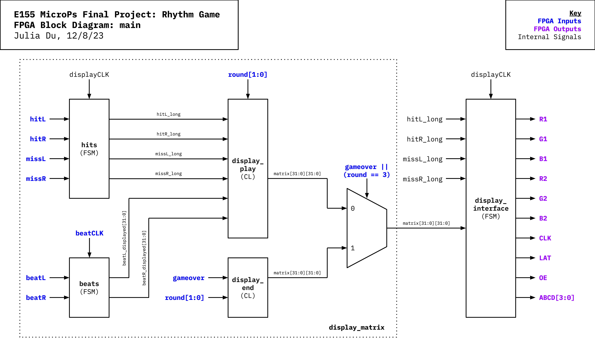

# New Hardware
The new hardware used was Adafruit's 32 x 32 LED matrix display. Unlike previous LED displays we have worked with, which include input pins for each row/column or segment, this display utilizes 13 GPIO pins to control 3072 different LEDs. The 13 pins allow for selecting specific rows of the display and clocking in RGB values for each LED in the row.

Two stands were 3D printed and attached to the display with 10mm M3 screws. The CAD for the stands are available .

# FPGA System Design

There are two main modules: `display_matrix` and `display_interface`. `display_matrix` uses the inputs from the microcontroller to determine what needs to be shown on the display, and `display_interface` communicates that information to the display itself. 
TODO: diff between display_matrix and display_interface
TODO: internal clock vs. external one

## display_matrix
`display_matrix` gets the following inputs from the microcontroller:
- `beatCLK`: sets the speed of the beats scrolling down the display. For each cycle of `beatCLK`, a beat moves down one pixel. 
- `beatL` and `beatR`: determine when a beat on the left/right side of the display should start scrolling down from the top.
- `hitL`, `hitR`, `missL`, `missR`: determines if the display should show that a player has hit/miss a beat on the left/right side.
- `round[1:0]`: determines the current round number. 0 represents round 1, 1 represents round 2, 2 represents round 3, and 3 represents a win for the player.
- `gameover`: determines if the player has lost the game.

The `beats` module is a FSM that keeps track of the position of beats on the display; on each side, there are 32 possible spaces. The `hits` module is used to extend the length of the `hitL`, `hitR`, `missL`, and `missR`. Without this module, the hit and miss indicators flash too fast for players to see them clearly.

The `display_play` and `display_end` modules contain combinational logic that outputs a 32 x 32 matrix that represents the state of the display during play and at the end of the game, respectively. A multiplexer chooses which of the two is sent to `display_interface`. Note that the 32 x 32 matrix doesn't contain any color data, only if a pixel is on or off. 

## display_interface
`display_interface` uses the FPGA's internal oscillator set to 24 MHz (`displayCLK`) and a 14-bit counter. For each cycle of the counter, the following occurs:
1. In 1 clock cycle, the module changes which rows it is addressing to. The address is 4 bits and is controlled by the `A`, `B`, `C`, and `D` outputs. An address of 0000 refers to the 1st and 17th row, an address of 0001 refers to the 2nd and 18th row, etc. 
2. In 32 clock cycles, the RGB data for the 32 pixels each row are clocked in with the `CLK` signal. `R1`, `G1`, and `B1` represents the data for the first of the two rows, and `R2`, `G2`, and `B2` represents the data for the second of the two rows. The RGB data are updated on the negative edge of `CLK`.
3. For 1 clock cycle, the latch signal `LAT` is set high to latch the RGB data into the display.
4. For 1 clock cycle, the output enable signal `OE` is set high to turn off the display.

The exact timing of these steps had to be adjusted for the display to work. We used the sources listed below and projects from previous years as references for this timing. 

This module is mostly a generic interface except for the colors of the hits and misses. Since most of the screen is either white or off, we found it unnecessary to deal with color values for every single pixel and instead used signals from the `display_matrix` module to determine when to turn specific portions of the display green or red (for hits and misses, respectively).

# Sources
Since there was no datasheet available for the display, the following sources were used to determine how it worked:
1. https://learn.adafruit.com/assets/23768
2. https://cdn-learn.adafruit.com/downloads/pdf/32x16-32x32-rgb-led-matrix.pdf
3. https://uselessrobots.com/2020/12/28/adafruit-led-matrix-control-with-verilog-1/